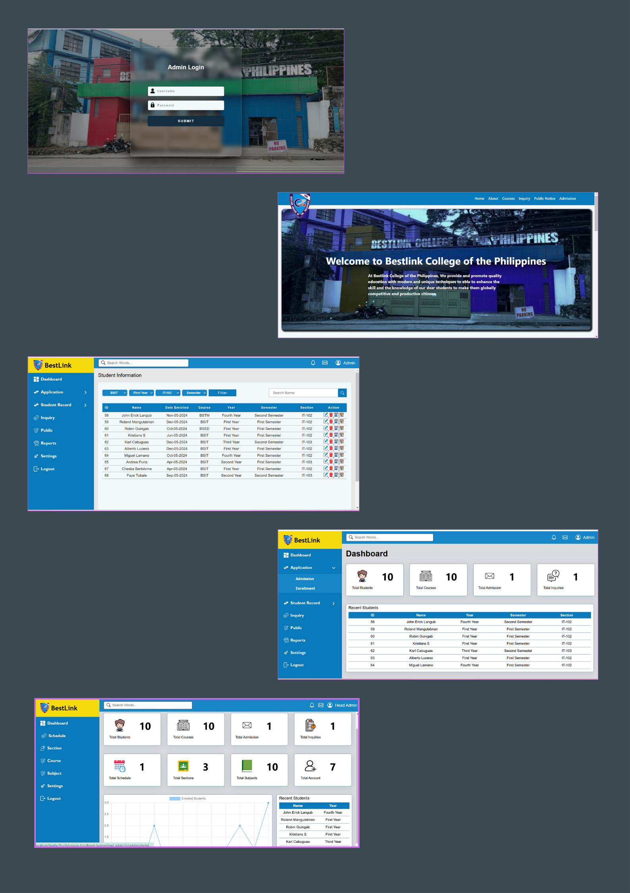

# Admission & Enrollment Management System
## Overview 📌
The Admission and Enrollment System enhances efficiency, reduces administrative workload, and improves the overall user experience by automating and streamlining the admission and enrollment processes for both students and staff.

## Features 📌
 - End User
    - Home: The main page with key information and navigation.
    - About: BestLink Mission/Vision.
    - Courses: Display available courses for enrollment.
    - Inquiry: Option for students to submit inquiries regarding admissions or courses.
    - Public Notice: A section for public announcements and important notices.
    - Admission: Online admission form submission.
 - Registra User
    - Dashboard: Overview of key statistics (total students, courses, admissions, inquiries, and recent students).
    - Admission List: Ability to view, read, and filter admission requests.
    - Enrollment List: View, update, and filter student enrollments
    - Student List: Create, read, update, and delete student records with search filters.
    - Requirement List: Manage admission requirements with CRUD functionality and filters.
    - Inquiry: View and filter student inquiries.
    - Public Notice: CRUD functionality for creating and managing public notices.
    - Reports: Generate and manage reports (including PDF generation) with search filters.
    - Settings: Allows the registrar to update their account password.
 - Head Admin
    - Dashboard: Overview of key statistics (students, courses, admissions, inquiries, schedule, subjects, sections, recent student, enrolled stundent).
    - Schedule: CRUD functionality for creating and managing academic schedules.
    - Section: Create, read, update, and delete course sections.
    - Course: CRUD functionality to manage available courses.
    - Subject: CRUD functionality to manage subjects offered within courses.
 - Login/Logout

## Tech Stack 📌
- **Frontend**: HTML, CSS, Bootstrap, AJAX, AOS
- **Backend**: PHP
- **Database**: MySQL
